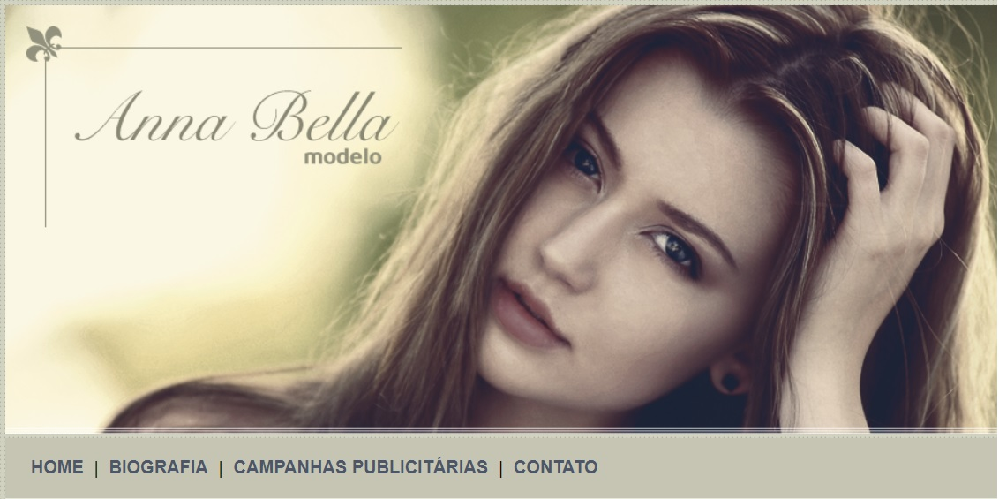

# Anna Bella

Welcome! 

This repository contains my solution for Institutional page of Personal web page for fictional model Anna Bella, using HTML and CSS.

This project was developed during the [Complete Web Development](https://www.udemy.com/course/web-completo/) course (Section CSS3) held at UDEMY.



# 🧠 About

The goal with this project is implement an static page using HMTL and CSS to learn and practice about this functionalities below:

- [x] CSS selectors
- [x] Borders
- [x] Text styles
- [x] Backgrounds
- [x] Build links
- [x] Change colors
- [x] Layouts

## 🖥️ Installation

1. Clone this repo
```bash
git clone https://github.com/robernar2011/AnnaBella.git
```
